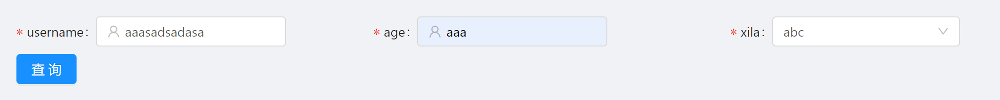
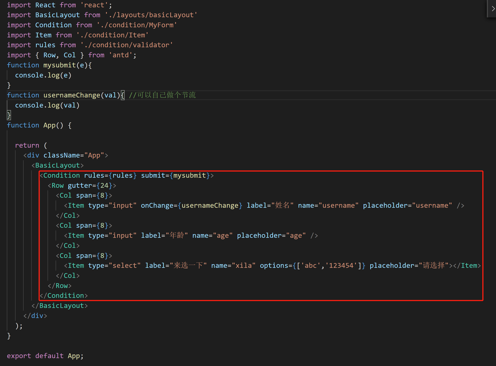

## 查询条件Condition组件

关键词：<b>antd-design@3.26.16 From 查询模块二次封装</b>

项目中大量的列表页面会用到查询条件功能，为避免重复的CV，我二次封装了antd-design From的组件，一来把与主业务（查询调接口，导入导出，下载，列表上的操作...）不相干的代码全抽到组件中去，二来方便使用。

下图是组件使用的效果图

## 安装与使用
1. clone项目

    > git clone xxxx

2. 安装依赖

    > npm i

3.  启动

    > npm start

